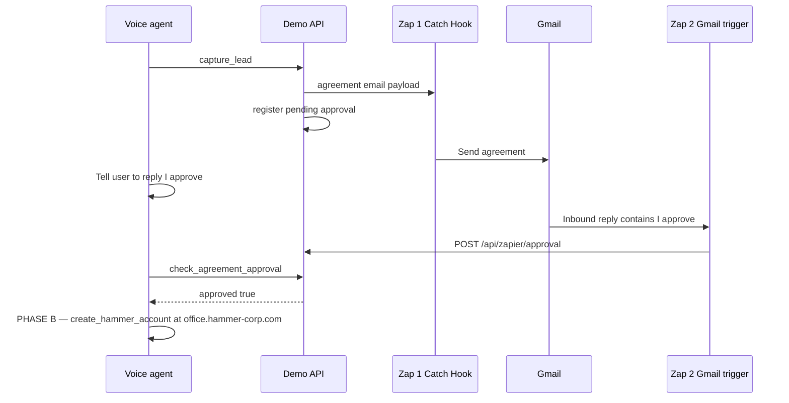

# Zap 2 — Detect “I approve” on agreement email replies

The voice agent **cannot** create a Hammer account until the visitor **replies to the agreement email** with **I approve**. Zap 1 sends the email; **Zap 2** notifies your server so `check_agreement_approval` returns approved.

## Flow



## Environment

In `server/.env`:

```env
ZAPIER_APPROVAL_CALLBACK_SECRET=choose-a-long-random-string
```

Use the **same** value in Zap 2 as header `X-Zapier-Secret`.

**Local (Zapier cannot use 127.0.0.1):** use **ngrok** — `ngrok http 8780` →  
`https://<subdomain>.ngrok-free.dev/api/zapier/approval`  
See `demo/realtime-sales-demo/LOCAL_NGROK.md`.

**Production (current):** `https://hammer-voice-telephony.fly.dev/api/zapier/approval`  
Use the Fly URL — **not** Vercel — for Zap 2 POST. The voice agent on [hammer-finalsite.vercel.app](https://hammer-finalsite.vercel.app) **reads** approval status from the same Fly host automatically (`agreement_approvals.py` when `REALTIME_SALES_SERVERLESS=1`).

**ngrok free tier:** add header `ngrok-skip-browser-warning: true` on the Zap POST step.

Approvals are stored in `server/.data/agreement_approvals.json` (override with `REALTIME_SALES_APPROVALS_PATH`).

## Zap 2 steps

1. **Trigger:** Gmail → **New Email** (or **New Email Matching Search**)
   - Search: `subject:agreement I approve` or inbox that receives agreement **replies**
   - Restrict to **replies** to your agreement messages when possible

2. **Filter (recommended)**
   - Only continue if **Body Plain** or **Body** **contains** `I approve` (case insensitive in Gmail is fine; server also validates)

3. **Action:** Webhooks by Zapier → **POST**
   - **URL:** `https://<your-host>/api/zapier/approval`
   - **Headers:**
     - `Content-Type: application/json`
     - `X-Zapier-Secret`: your `ZAPIER_APPROVAL_CALLBACK_SECRET`
   - **JSON body:**

```json
{
  "email": "{{from email}}",
  "approved": true,
  "reply_text": "{{body plain}}"
}
```

Map `email` from the **sender** of the reply (the dealer’s address — must match `capture_lead` email).

4. **Test:** Reply to a test agreement with `I approve`, run Zap 2, then:

```bash
curl "http://127.0.0.1:8780/api/zapier/approval-status?email=their@email.com"
```

Should return `"approved": true`.

## Voice agent

- After `capture_lead`: confirm receipt → tell them to reply **I approve** → **wait**
- The instant they say they replied or **I approve** on the call: speak a short confirming line, call **`check_agreement_approval`** with **`just_replied`: true** (server polls ~12s for Zap 2), and **while polling** ask PHASE B account questions + **`fill_hammer_account_field`** (form prewarmed at capture_lead). Do **not** confirm email **I approve** until the tool returns approved.
- If still pending after poll: keep collecting account fields; optional syncing line; call again with **`just_replied`: true** once more.
- When approved: Tyler **always** confirms **I approve received on the agreement email** (even if account questions already started), then continues PHASE B — skip fields already collected; do not preview Welcome email, Activate, password, or card on that turn

Tune poll duration in `.env`: `AGREEMENT_APPROVAL_JUST_REPLIED_WAIT_SECONDS` (default 12), `AGREEMENT_APPROVAL_POLL_MAX_SECONDS` (default 20).
- Tool polls up to **25s** if they just replied (Gmail→Zap delay)
- **Do not** start account setup until the tool returns **approved**

## Manual test (no Gmail)

```bash
curl -X POST http://127.0.0.1:8780/api/zapier/approval \
  -H "Content-Type: application/json" \
  -H "X-Zapier-Secret: YOUR_SECRET" \
  -d "{\"email\":\"test@dealer.com\",\"approved\":true,\"reply_text\":\"I approve\"}"
```
